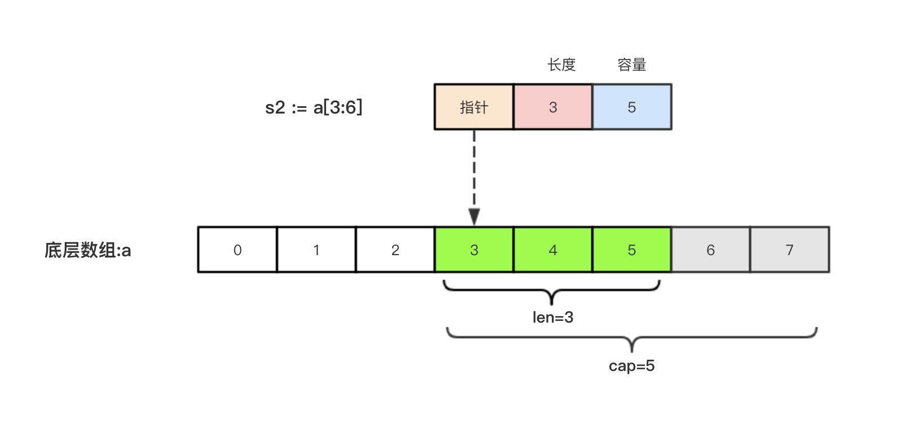

## 切片

切片是一个新的数据类型, 与数组最大的区别在于, 切片的类型字面量中只有元素的类型, 没有长度

因此切片是一个长度可变的, 同一类型的元素集合, 切片的长度可以随着元素数量的增加而增长, 但不会随着元素减少而减小

## 创建切片

创建切片有三种办法. 基于数组, 切片和直接创建

### 基于数组

```go
array := [...]{1, 2, 3, 4, 5}
s1 := array[1:4] // [2 3 4]
```

切片的底层引用了一个数组, 由三部分构成: 指针, 长度和容量. 指针指向数组的起始下标, 长度对应切片中元素个数, 容量则是切片起始位置到底层数组结尾的位置

因此, 切片的长度不能超过容量


### 基于切片

```go
s2 := s1[:2] // [2 3]
```

### 直接创建

创建长度为3的整型切片

```go
slice := make([]int, 3)
```

创建长度为3, 容量为5的整形切片

```go
slice := make([]int, 3, 5)
```

包含初始元素的切片, 长度和容量都为3

```go
slice := []int{1, 2, 3}
```

## 内存优化

切片持有怼底层数组的引用. 只要切片在内存中, 数组就不会被垃圾回收

使用copy函数`func copy(dst, src[]T) int`来生成一个切片副本, 原始数组就可以被垃圾回收

```go
package main

import "fmt"

func counties() []string {
	countries := []string{"USA", "Singapore", "Germany", "India", "Australia"}
	needCountries := countries[:len(countries)-2]
	countriesCopy := make([]string, len(needCountries))
	copy(countriesCopy, needCountries)
	return countriesCopy
}

func main() {
	countriesNeeded := counties()
	fmt.Println(countriesNeeded)
}
```
