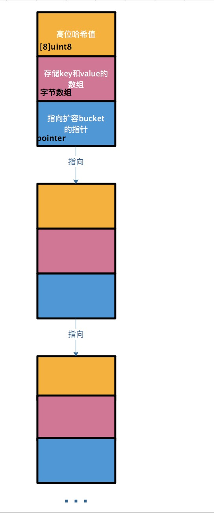

## map

和slice类似, map也是引用类型, 当map被复制为一个新的变量时, 他们只想同一个内部数据结构. 因此改变其中一个变量, 另一个也会收到影响.

```go
package main

import "fmt"

func main() {
	personSalary := map[string]int{
		"steve": 12000,
		"jamie": 15000,
	}
	personSalary["mike"] = 9000
	fmt.Println("Original person salary", personSalary)

	newPersonSalary := personSalary
	newPersonSalary["mike"] = 18000
	fmt.Println("Person Salary changed", personSalary)
}
```

## map的相等性

map之间不饿能使用`==`操作符判断, ==只能用来检查map是否为`nil`

## map底层实现原理

### map整体结构图

go中map底层实现是一个散列表, 因此实现map的过程就是实现散列表的过程. 在这个散列表中, 主要出现的结构体有两个, 一个叫`hmap`, 一个叫`bucket`

**hmap:**


**bucket:**



由此可以看出, `hmap`和`bucket的关系是这样的`:


而`bucket`又是一个链表, 所以, 整体结构应该是这样的:


### 哈希函数

哈希表的特点是会有一个哈希函数, 对传过来的key进行hash运算, 得到唯一分值, 一般情况下都是一个数值.

在go中, 将求到的hash值一分为二: 高位和低位

```
key ---> hash函数f(x) ---> 1234567887654321
```

在上个公式中, `12345678`为高位, `87654321`为低位. 低位用于寻找当前key属于哪个`bucket`, 而高位用于寻找`bucket`中的哪个key

特别指出: 在map中的key/value都是存储到同一个数组中的


### map的扩容

当以上哈希表持续增长时, Go会将`bucket`数组的数量扩充一倍, 产生一个新的`bucket`数组, 并将就数组数据迁移到新数组

#### 加载因子

`加载因子`是一个阈值, 一般表示为:

```
加载因子 = 散列包含的元素数 / 位置总数
```

`加载因子`越小, 说明空间空置率越高, 空间使用率小, `加载因子`越大, 说明空间利用率上去了, 但是**产生冲突概率**高了

当go的map长度增长到大于`加载因子`所需的长度时, 就会产生一个新的`bucket`数组, 然后将旧的`bucket`数组迁移到一个属性字段`oldbucket`中

**注意: 迁移时并不会立即将旧数组中的元素迁移到新的`bucket`中, 只有在访问到具体`bucket`时才会把数据转移到新的`bucket`中**

### 删除数据

1. 如果key是一个指针类型, 则直接将其置为空, 等待GC清除;
2. 如果是值类型, 则清除相关内存
3. 对value也做同样的操作
4. 最后把key对应的高位值的数组index置为空